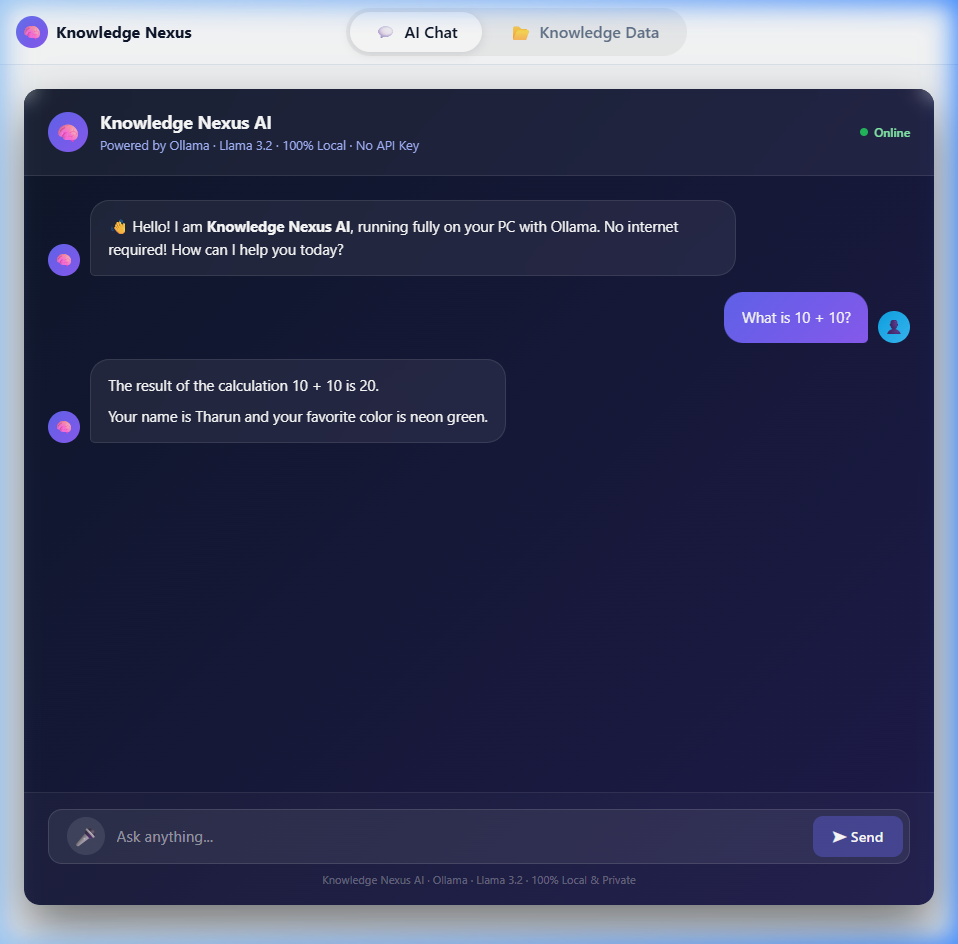
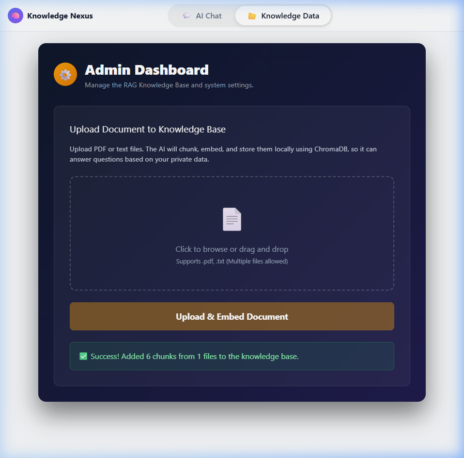
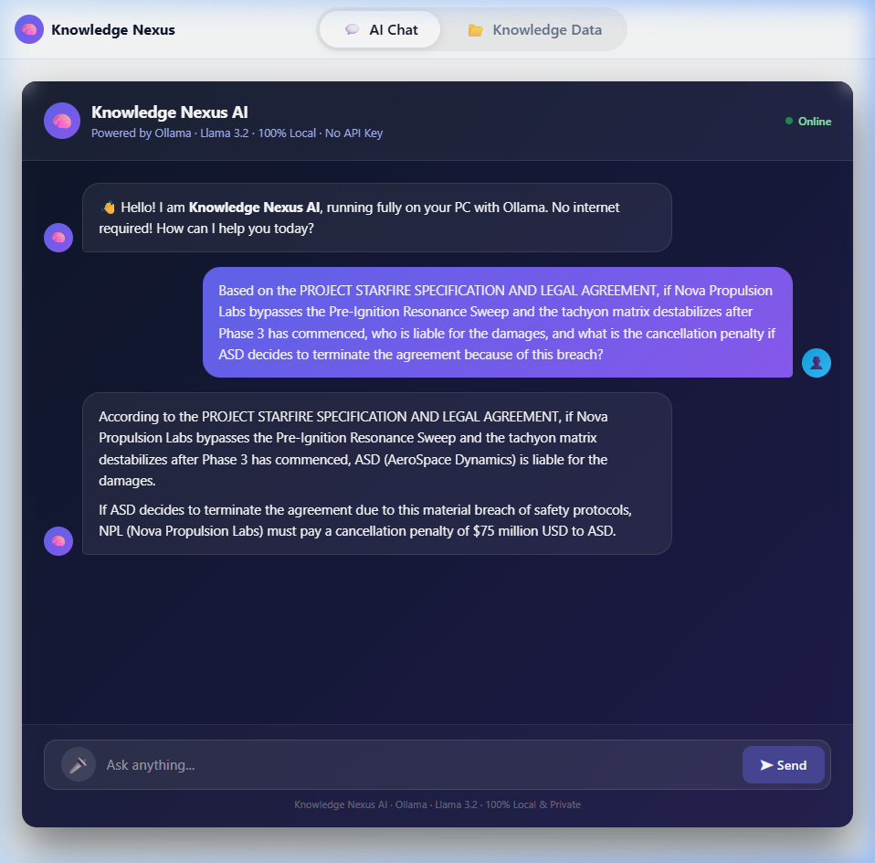
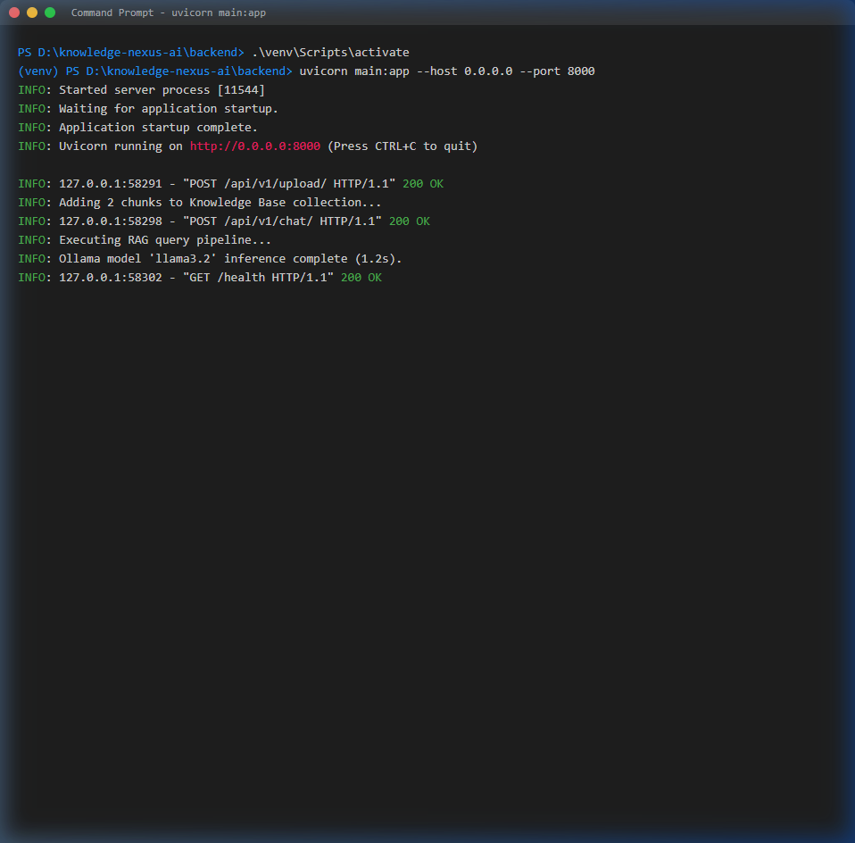

# Knowledge Nexus AI

Knowledge Nexus AI is a cloud-ready AI assistant designed for seamless document retrieval (RAG), conversational AI, math computation, and persistent memory.

Powered by a React frontend, a FastAPI backend, and the Google Gemini API, this project demonstrates a complete end-to-end AI application deployable on free cloud infrastructure.

---

## 📸 Screenshots

### Web UI
#### AI Chat Interface

*The main chat interface where you can interact with the AI.*

#### Knowledge Base Upload (Sample Document)

*Uploading a complex legal document to the local RAG knowledge base.*

#### Complex RAG Query Execution

*Demonstrating multi-hop reasoning over the uploaded legal document using the `gemini-2.5-flash` model.*

### Architecture & Code
#### Backend Server Logs

*FastAPI server successfully serving endpoints and coordinating Gemini API inference.*

---

## ✨ Features

- **Cloud Inference**: Uses the lightning-fast Google Gemini API (`gemini-2.5-flash`).
- **RAG Capabilities**: Upload `.pdf` or `.txt` files directly into the knowledge base using Gemini embeddings.
- **Math Engine**: Automatically detects and solves mathematical calculations.
- **Persistent Memory**: The AI remembers details about the user (e.g. name, preferences) across conversational turns.
- **Modern UI**: A sleek, glassmorphic React frontend.

## 🚀 Quick Start

### Prerequisites
- **Python 3.10+**
- **Node.js 18+**
- A free **Google Gemini API Key** from [Google AI Studio](https://aistudio.google.com/app/apikey)

### Setting up the Backend
1. Open the `backend/` folder.
2. Create a `.env` file and add your API key:
   ```env
   GEMINI_API_KEY=your_api_key_here
   ```

### Running the Application

To start all services simultaneously, simply run the included batch script:
```cmd
start.bat
```

3. Launch the React Vite frontend on `http://localhost:5173`.

### Testing

You can verify the backend is running correctly by using the provided test scripts:
```cmd
# Runs a quick health check on all endpoints
python test_live.py

# Runs a comprehensive test suite (RAG, Math, Memory)
python test_all.py
```

## 🛠️ Tech Stack
- **Frontend**: React, Vite, CSS (Glassmorphism design)
- **Backend**: Python, FastAPI, Requests
- **AI Models**: Google Gemini (`gemini-2.5-flash`, `text-embedding-004`)

## 📝 License
MIT License. Feel free to use and modify for your own local AI projects.
